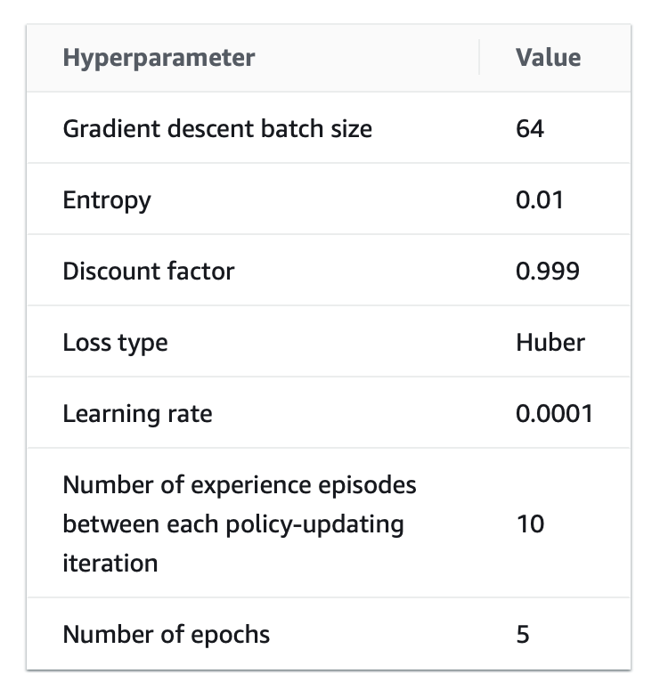
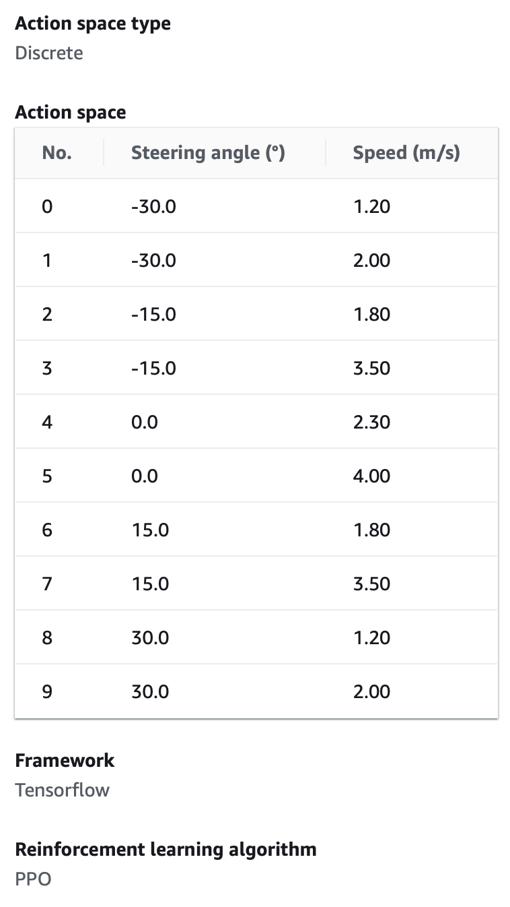
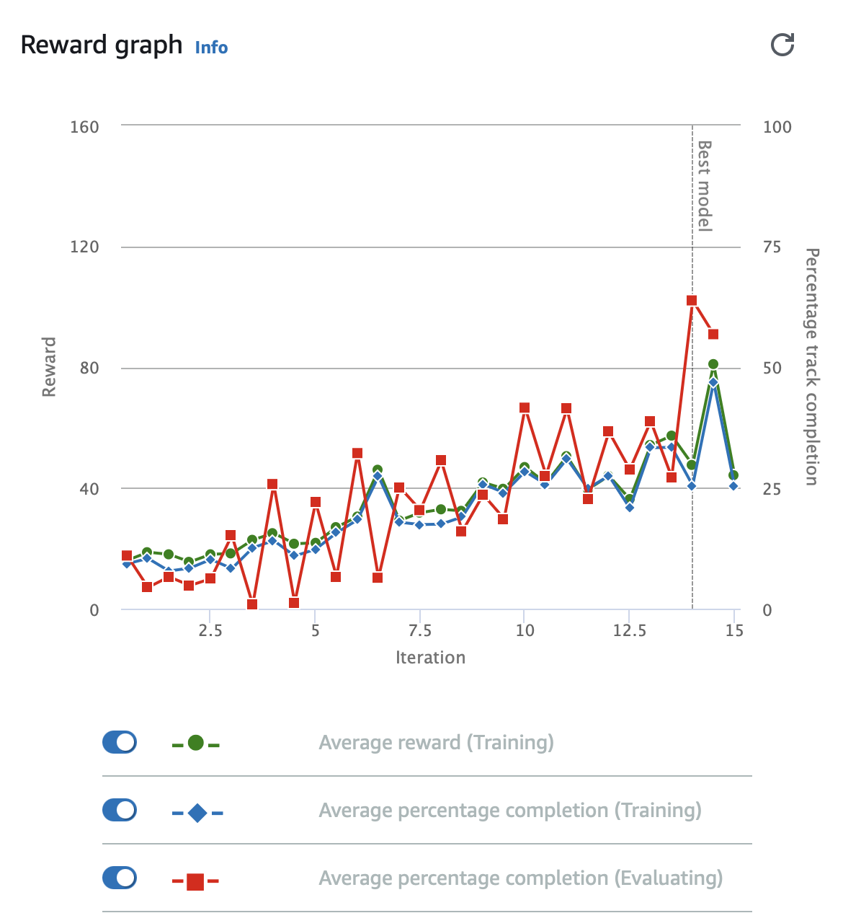
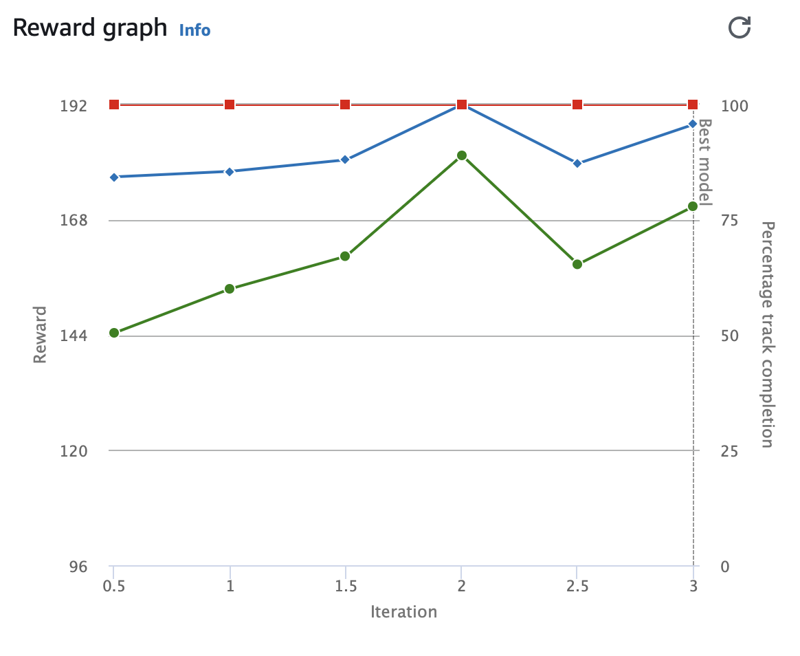

# Introduction

Dans le cadre du concours organisé par AWS et Accenture, nous avons eu l'opportunité unique de plonger dans le monde fascinant de l'apprentissage par renforcement en participant à la compétition AWS DeepRacer. Ce défi a consisté à développer et à affiner un modèle d'intelligence artificielle qui pilote de manière autonome un véhicule physique sur une piste de course. Mon coéquipier Enzo Desbois, étudiant en ingénierie logicielle, et moi avons collaboré étroitement pour explorer les complexités de l'apprentissage par renforcement en utilisant l'environnement AWS DeepRacer.

Le concours s'est déroulé sur trois jours intensifs, les 12, 13 et 14 décembre, où le temps était une ressource aussi précieuse que les données d'entraînement elles-mêmes. Nous étions contraints par un nombre limité d'heures d'entraînement, ce qui nous a obligés à adopter une approche stratégique et réfléchie. Notre aventure nous a emmenés à travers diverses expérimentations avec des hyperparamètres et des fonctions de récompense, nous permettant de plonger dans les détails techniques qui déterminent les performances des modèles de Machine Learning.

Ce rapport a pour objectif de présenter notre approche méthodique, l'évolution de notre compréhension et les choix techniques qui nous ont menés à cette réussite. Il détaille notre parcours depuis les premières heures d'essais, en passant par la transition d'un modèle à déplacements continus à un modèle à déplacements discrets, jusqu'à la mise au point d'une fonction de récompense personnalisée qui a été la clé de notre performance.

Nous aborderons la manière dont nous avons commencé par comprendre les hyperparamètres et leur impact, l'importance d'une fonction de récompense bien conçue, et comment l'adaptation d'une stratégie déjà existnate a été affinée pour convenir à notre modèle spécifique. Ce rapport témoigne non seulement de notre parcours d'apprentissage mais aussi de la richesse de l'apprentissage par renforcement et de son application pratique dans le cadre d'une compétition.

# I. Hyperparamètres

L'apprentissage par renforcement est un domaine de l'intelligence artificielle où les agents apprennent à prendre des décisions en interagissant avec leur environnement. Dans ce paradigme, la sélection judicieuse des hyperparamètres joue un rôle important pour guider efficacement l'apprentissage. Lors de notre participation au concours, notre premier objectif était de comprendre l'impact de ces hyperparamètres sur le comportement de notre modèle d'intelligence artificielle.

Nous avons entamé notre quête avec l'exploration des hyperparamètres suivants :

<figure>
	
	<figcaption>Hyperparamètres du modèle final</figcaption>
</figure>

1.  **Gradient descent batch size** : Nous avons commencé avec un batch size de 32, puis sommes rapidement passés à 64, permettant au modèle de trouver un équilibre entre la précision de l'estimation du gradient et l'utilisation efficace de la mémoire. Nous avons rapidement appris que des lots trop grands pourraient lisser les détails nécessaires pour l'apprentissage tandis que des lots trop petits pourraient conduire à une convergence erratique.
    
2.  **Entropy** : Réglée à 0.01, cette valeur visait à introduire un niveau d'aléatoire dans la sélection des actions, encourageant l'exploration sans dépasser l'exploitation des connaissances déjà acquises.
    
3.  **Discount factor** : Avec un facteur proche de l'unité (0.999), notre modèle était encouragé à prendre en considération les récompenses futures, ce qui est notamment utile pour des tâches où la gratification n'est pas immédiate.

4.  **Loss type** : Nous avons opté pour la fonction de perte Huber, une combinaison entre l'erreur quadratique moyenne pour les petites erreurs et l'erreur absolue moyenne pour les grandes, réduisant ainsi la sensibilité aux anomalies.
    
5.  **Learning rate** : Le taux de 0.0001 a été choisi pour permettre des ajustements progressifs des poids du modèle, cherchant à éviter les changements trop drastiques qui pourraient nuire à l'apprentissage.
    
6.  **Number of experience episodes between each policy-updating iteration** : Nous avons fixé ce nombre à 10 pour permettre au modèle d'accumuler suffisamment d'expériences avant de procéder à une mise à jour, assurant ainsi que chaque ajustement est bien informé.
    
7.  **Number of epochs** : En fixant le nombre d'epochs à 5, nous avons veillé à ce que le modèle réexamine les expériences recueillies plusieurs fois, renforçant l'apprentissage sans tomber dans le surajustement.

Au cours de cette phase initiale, nous avons également utilisé la fonction de récompense par défaut pour comprendre comment ces hyperparamètres interagissaient avec la dynamique de la piste. À travers un processus d'essais et d'erreurs, nous avons commencé à saisir comment chaque paramètre affectait la capacité du modèle à apprendre de ses actions et à s'améliorer.

Nos premières sessions d'entraînement nous ont permis de construire une solide fondation de connaissances. Cependant, il est devenu évident que pour surpasser nos concurrents, nous devions aller au-delà de la compréhension théorique pour affiner notre modèle de manière plus stratégique. Il était temps d'optimiser notre approche et de personnaliser notre fonction de récompense, ce qui nous a conduit à la prochaine phase de notre parcours : l'optimisation et le passage à un modèle à déplacements discrets.

# II. Optimisations et déplacements discrets

Après avoir établi une compréhension de base des hyperparamètres et de leur influence sur le processus d'apprentissage, nous avons entamé la deuxième phase de notre projet : l'optimisation du modèle. Cette étape a été caractérisée par une transition stratégique des déplacements continus vers un modèle à déplacements discrets, une décision qui a grandement influencé la performance de notre modèle.

Dans notre exploration initiale, nous avons entraîné notre modèle en utilisant des actions continues, où le modèle avait la liberté de choisir n'importe quel angle de rotation pour naviguer sur la piste. Cette flexibilité semblait avantageuse au premier abord, car elle permettait une adaptation fine à la trajectoire. Cependant, cette approche a également introduit une complexité significative. La tendance du modèle à opter pour des manœuvres subtiles et fréquentes a mené à un comportement le poussant souvent à faire des zigzags, nuisant à la vitesse globale et à l'efficacité du parcours.

La prise de conscience de ces limitations a été un tournant. Nous avons décidé d'adopter une approche basée sur des actions discrètes, comme en témoigne notre tableau d'espaces d'actions, où chaque action était liée à un angle de braquage spécifique et à une vitesse définie. Ce cadre contraint a simplifié l'espace des actions, permettant au modèle de faire des choix plus stratégiques et délibérés.



Le passage à des déplacements discrets a eu plusieurs avantages immédiats. Premièrement, cela a réduit le comportement erratique de la voiture, lui permettant de suivre des trajectoires plus directes et plus rapides. Deuxièmement, cela a permis une accélération plus cohérente, car le modèle pouvait maintenant se concentrer sur la sélection de la meilleure action prédéfinie pour une situation donnée, plutôt que d'ajuster constamment à des degrés infimes.

L'effet de ces changements a été clairement illustré dans les performances de notre modèle. Les graphiques de récompense, qui suivaient les progrès au fil des itérations d'entraînement, ont montré une amélioration significative. Non seulement la voiture complétait la piste avec une plus grande cohérence, mais le temps nécessaire pour compléter le parcours a également diminué, nous rapprochant de notre objectif de vitesse et de précision.

<figure>
	
	<figcaption>Graphique de récompenses sur un des premiers modèles</figcaption>
</figure>

<figure>
	
	<figcaption>Graphique de récompenses final</figcaption>
</figure>

Cette phase d'optimisation a également été une période d'apprentissage intense pour nous en tant que concepteurs du modèle. Nous avons appris l'importance de l'équilibre entre la flexibilité et la contrainte dans la conception d'un système d'apprentissage par renforcement. Trop de flexibilité peut conduire à la confusion et à l'inefficacité, tandis que des contraintes appropriées peuvent guider l'agent vers des comportements plus optimaux.

En fin de compte, l'adoption d'un modèle à déplacements discrets a été une décision déterminante, prouvant que la simplicité et la clarté de la structure peuvent souvent surpasser la complexité. Cela nous a préparés pour la phase finale de notre projet : la personnalisation de la fonction de récompense, qui s'est avérée être la clé de notre succès.

# III. Meilleur système de récompenses et impact

La phase finale de notre parcours s'est concentrée sur la conception et l'implémentation d'une fonction de récompense personnalisée. Cette étape a été essentielle pour affiner le comportement de notre modèle et pour maximiser ses performances sur la piste.

**3.1 Comment fonctionne notre fonction de reward ?**

Inspirés par la fonction de reward utilisée par l'équipe IndestruciRacer en 2019, nous avons adapté leur approche à notre contexte. La clé de leur succès résidait dans une fonction de récompense qui favorisait la prise de décision stratégique et l'adaptation à des conditions de piste variables. 

Ici, nous allons détailler le fonctionnement de notre fonction, en soulignant comment elle intègre la logique des waypoints pour optimiser la trajectoire de notre véhicule.

La fonction `identify_corner` joue un rôle fondamental dans notre stratégie de récompense. Elle utilise les waypoints pour déterminer la configuration de la piste devant la voiture et ajuste la récompense en fonction. Voici un exemple concret de la façon dont cela fonctionne:


```python
def  identify_corner(waypoints, closest_waypoints, future_step):
	...
	heading_future = math.degrees(math.atan2(point_prev[1] - point_future[1], point_prev[0] - point_future[0]))
	...
	dist_future = np.linalg.norm([point_next[0] - point_future[0], point_next[1] - point_future[1]])
	...
```

Dans cet extrait, la fonction calcule l'orientation future (`heading_future`) et la distance jusqu'au prochain waypoint éloigné (`dist_future`). Ces calculs sont utilisés pour évaluer si un virage se profile à l'horizon, ce qui influencera la vitesse que le modèle devrait adopter.

Ensuite, la fonction `select_speed` utilise ces informations pour décider si la voiture doit accélérer ou ralentir:

```python
def  select_speed(waypoints, closest_waypoints, future_step, mid_step):
	... 
	if diff_heading < TURN_THRESHOLD:
		go_fast =  True
	else:
	...
	if  diff_heading_mid < TURN_THRESHOLD:
		go_fast =  True 
	else:
	go_fast =  False
	...
```

Cette logique conditionnelle ajuste la récompense selon que le véhicule doit négocier un virage ou peut accélérer en ligne droite. Le modèle est encouragé à adopter une vitesse plus élevée lorsqu'il se dirige vers une ligne droite et à ralentir lorsqu'un virage est imminent.

La récompense totale est ensuite calculée en tenant compte de plusieurs critères, comme la proximité du centre de la piste, le progrès réalisé par rapport aux étapes franchies, et la vitesse en relation avec le seuil défini et l'angle de braquage:

```python
reward =  1  - (distance_from_center/(track_width/2))**(1/4) + progress/steps
...
if go_fast  and  speed > SPEED_THRESHOLD:
	reward +=  0.5
...
if  go_fast and abs(params['steering_angle']) <  5:
	reward += STRAIGHT_SPEED_BONUS
...
```

Dans ces lignes, la variable `reward` est ajustée pour inciter la voiture à rester près du centre de la piste, ce qui est utile pour maintenir une trajectoire optimale. De plus, des bonus sont accordés pour la vitesse maintenue dans les lignes droites et pour la sélection d'une action spécifique (angle de braquage nul à la vitesse maximale), visant à optimiser les temps au tour.

De plus, notre fonction de reward a été structurée autour de plusieurs composants clés :

-   **Anticipation des virages** : En utilisant `FUTURE_STEP`, notre modèle était capable d'anticiper les virages à venir et d'ajuster sa vitesse et sa trajectoire en conséquence.
-   **Différenciation entre les virages et les lignes droites** : Grâce à la détection des virages avec `TURN_THRESHOLD`, nous avons pu moduler les récompenses pour encourager une approche prudente dans les virages et une accélération sur les segments droits.
-   **Adaptation de la vitesse** : Le `SPEED_THRESHOLD` nous a permis de récompenser les vitesses optimales, en évitant à la fois la lenteur excessive et les excès pouvant entraîner des dérapages ou des sorties de piste.
-   **Bonus pour les lignes droites** : Avec le `STRAIGHT_SPEED_BONUS`, notre modèle a été incité à maintenir des vitesses élevées sur les portions droites, améliorant ainsi les temps au tour.

**3.2 Impact de cette fonction sur les performances**

L'intégration de cette fonction de récompense personnalisée a conduit à des améliorations tangibles. Les graphiques de récompense de notre modèle final ont mis en évidence une courbe d'apprentissage plus stable et une augmentation progressive des récompenses obtenues par l'agent, ce qui a indiqué une meilleure cohérence et efficacité dans la réalisation des tours de piste.

<figure>
	
	<figcaption>Graphique de récompenses final</figcaption>
</figure>

Nous avons observé que notre véhicule avait appris à naviguer sur la piste avec une bonne précision, évitant les excès qui avaient auparavant entravé ses performances. La fonction de récompense a effectivement aligné les objectifs d'apprentissage du modèle avec les exigences de la compétition, résultant en une conduite qui était fiable et plutôt rapide.

**3.3 Leçons tirées et perspectives futures**

Ce processus de personnalisation a souligné l'importance d'une compréhension profonde de la manière dont les fonctions de récompense influencent l'apprentissage par renforcement. Chaque composant de la fonction a été soigneusement examiné et testé pour garantir qu'il contribuait positivement à l'objectif global de notre modèle.

Cette phase de notre projet a révélé l'importance de l'itération et de l'expérimentation. Les ajustements successifs de la fonction de récompense, basés sur de nombreuses observations et des analyses des performances, ont été nécessaires afin de créer un modèle fiable qui répond aux exigences.

Enfin, notre exploration dans la personnalisation de la fonction de reward a non seulement été fructueuse en termes de résultats, mais elle a également enrichi notre compréhension de l'apprentissage par renforcement. Elle a souligné le pouvoir d'une approche réfléchie et mesurée dans le développement de modèles de Machine Learning, et elle promet des avancées passionnantes dans nos futures initiatives de recherche et de développement en intelligence artificielle.

# Conclusion

La participation au concours AWS DeepRacer organisé par AWS et Accenture a été une expérience formatrice et très intéressante pour nous. Elle nous a permis de plonger dans le monde du Machine Learning et de concrétiser nos connaissances théoriques en compétences pratiques.

Chaque étape de cette aventure a contribué à façonner un modèle robuste et efficace. Nous avons mis en lumière l'importance de comprendre l'impact des hyperparamètres, l'efficacité des déplacements discrets pour simplifier et concentrer l'apprentissage sur des circuits simples, et la puissance d'une fonction de reward bien conçue pour guider le modèle vers un temps au tour avantageux.

Pour terminer, nous tenons à exprimer notre gratitude envers AWS et Accenture pour la mise en place de cette compétition qui nous a permis de découvrir le Machine Learning et mettre à l'épreuve nos compétences tout en prenant du plaisir. Nous sommes impatients d'appliquer les leçons apprises ici à de futurs défis et de continuer à explorer les vastes horizons de l'intelligence artificielle. Notre expérience à ce concours est un témoignage de l'impact que l'IA peut avoir, et nous sommes inspirés à poursuivre cette voie prometteuse.
